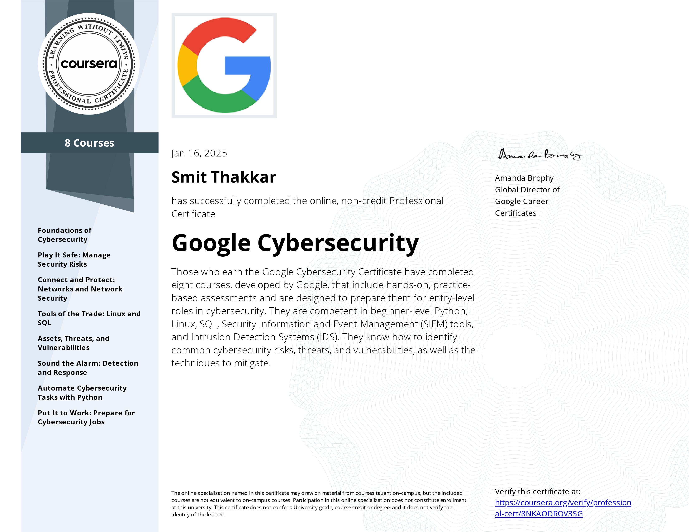

# Google Cybersecurity Portfolio  

This repository showcases the comprehensive projects and tasks I completed as part of the **Google Cybersecurity Certificate** program. It includes practical applications of cybersecurity concepts, tools, and frameworks to solve real-world security challenges. Each folder represents a module of the course, with corresponding deliverables and detailed reports.

---

## Table of Contents  

1. **[Foundations of Cybersecurity](#1-foundations-of-cybersecurity)**  
2. **[Play It Safe: Manage Security Risks](#2-play-it-safe-manage-security-risks)**  
3. **[Connect and Protect: Networks and Network Security](#3-connect-and-protect-networks-and-network-security)**  
4. **[Tools of the Trade: Linux and SQL](#4-tools-of-the-trade-linux-and-sql)**  
5. **[Assets, Threats, and Vulnerabilities](#5-assets-threats-and-vulnerabilities)**  
6. **[Sound the Alarm: Detection and Response](#6-sound-the-alarm-detection-and-response)**  
7. **[Automate Cybersecurity Tasks with Python](#7-automate-cybersecurity-tasks-with-python)**  
8. **[Put It to Work: Prepare for Cybersecurity Jobs](#8-put-it-to-work-prepare-for-cybersecurity-jobs)**  

---

## 1. Foundations of Cybersecurity  

- **Professional Statement**: A PDF that outlines my commitment to cybersecurity and my approach to protecting information systems.  

---

## 2. Play It Safe: Manage Security Risks  

- **Security Audit - NIST CSF**  
  - Risk assessment reports and compliance checklists to manage and mitigate risks.  
  - Key Deliverables:  
    - Scope, goals, and risk assessment report.  
    - Controls and compliance checklist.  

---

## 3. Connect and Protect: Networks and Network Security  

- **Incident Response Using NIST CSF**  
  - Incident analysis and reports using the NIST Cybersecurity Framework.  
  - Key Deliverables:  
    - Incident report analysis.  
    - Response strategy documentation.  

---

## 4. Tools of the Trade: Linux and SQL  

- **Linux**  
  - File permissions management and employee management reports.  
- **SQL**  
  - Filtering and joining data to investigate incidents and retrieve sensitive information.  
  - Key Deliverables:  
    - SQL query analysis reports.  
    - Security incident investigation using SQL Joins.  

---

## 5. Assets, Threats, and Vulnerabilities  

- **Decrypting Hidden Messages in Linux**  
  - Practical implementation of Caesar cipher decryption.  
- **File Integrity Verification**  
  - Comparison of file hashes for integrity checks.  
- **Threat Analysis with PASTA Framework**  
  - Development of attack trees and data flow diagrams.  

---

## 6. Sound the Alarm: Detection and Response  

- **Network Traffic Analysis**  
  - Capture and analyze live network traffic using tools like `tcpdump` and Wireshark.  
- **Phishing Incident Investigation**  
  - Analysis and resolution of phishing incidents.  
- **SOC Investigation**  
  - Examination of malicious file downloads and ransomware attacks.  

---

## 7. Automate Cybersecurity Tasks with Python  

- **File Update Algorithm**  
  - Python-based automation for file updates.  
  - Key Deliverable:  
    - Report on Python script development and execution.  

---

## 8. Put It to Work: Prepare for Cybersecurity Jobs  

- Career preparation, including resume building, mock interviews, and job search strategies.  

---

## Certification  

  

---

### How to Use  

Each folder contains specific scenarios, reports, and deliverables tied to the coursework. Refer to the `Scenario.pdf` files for context and the corresponding reports for in-depth analyses and solutions.  

---

### Contact  

For further information or collaboration opportunities, feel free to reach out!  
- **Email**: [thakkarsmit@myyahoo.com]  
- **LinkedIn**: [https://linkedin.com/in/smit-thakkar2428]  

---
